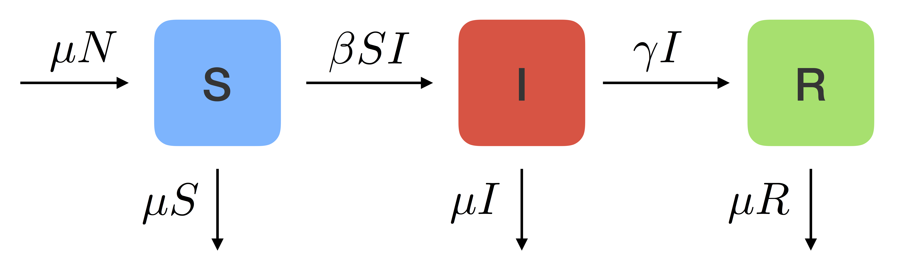
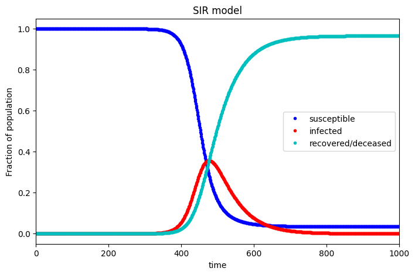
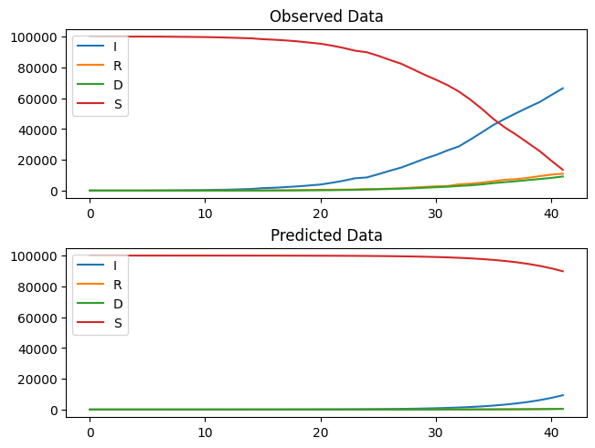

# Compartmental models-in-epidemiology
Implementation of mathematical modeling of infectious diseases used to study the spread of diseases.
Disease-spreading models are mathematical frameworks used to understand and predict the dynamics of infectious diseases within a population. These models aim to capture the interactions between individuals and the spread of the disease over time. By simulating the transmission process and the movement of individuals between different states, these models provide insights into the potential impact of interventions and help in making informed decisions for disease control and prevention.

There are several types of disease-spreading models, but three commonly used models are the SIR, SIRD, and SIRIs models:

## SIR Model:
The SIR model divides the population into three compartments: Susceptible (S), Infected (I), and Recovered (R). It assumes that individuals in the population can be categorized into one of these compartments. The model tracks the flow of individuals between these compartments over time. Initially, individuals are susceptible to the disease (S). The graph below demonstrates the change of population in the mentioned groups:

When a susceptible individual comes into contact with an infected individual, they become infected (I). Infected individuals can spread the disease to susceptible individuals. Over time, infected individuals either recover and become immune (R) or remain infected until the end of the disease's duration. The SIR model assumes that once individuals recover, they acquire lifelong immunity to the disease.

The final SIR model can be implemented as below:

## SIRD Model:
The SIRD model extends the SIR model by incorporating an additional compartment for deaths (D). In addition to the Susceptible (S), Infected (I), and Recovered (R) compartments, the SIRD model includes a compartment for individuals who have died due to the disease (D). This model takes into account the possibility of mortality associated with the disease. It considers that some infected individuals may not recover but instead progress to the death state. The SIRD model helps in estimating the impact of the disease on mortality rates and the overall fatality of the outbreak.
The final SIRD model can be implemented as below:

## SIRIs Model:
The SIRIs model is an extension of the classic SIR model that incorporates the concept of isolation or quarantine. It is used to study the spread of infectious diseases within a population while considering the effects of isolating infected individuals. In the SIRIs model, the population is divided into four compartments:

- Susceptible (S): Individuals who are susceptible to the disease.
- Infected (I): Individuals who are infected and can transmit the disease.
- Recovered (R): Individuals who have recovered from the disease and are immune.
- Isolated (Is): Individuals who have been isolated or quarantined to prevent further transmission.
The graph below demonstrates the change of population in the mentioned groups:

By incorporating isolation into the model, the SIRIs framework allows for the assessment of the effectiveness of isolation measures in controlling or mitigating the spread of infectious diseases. It helps to understand how isolating infected individuals can reduce the overall transmission rate and potentially slow down the epidemic curve.
The final SIRIs model can be implemented as below:

